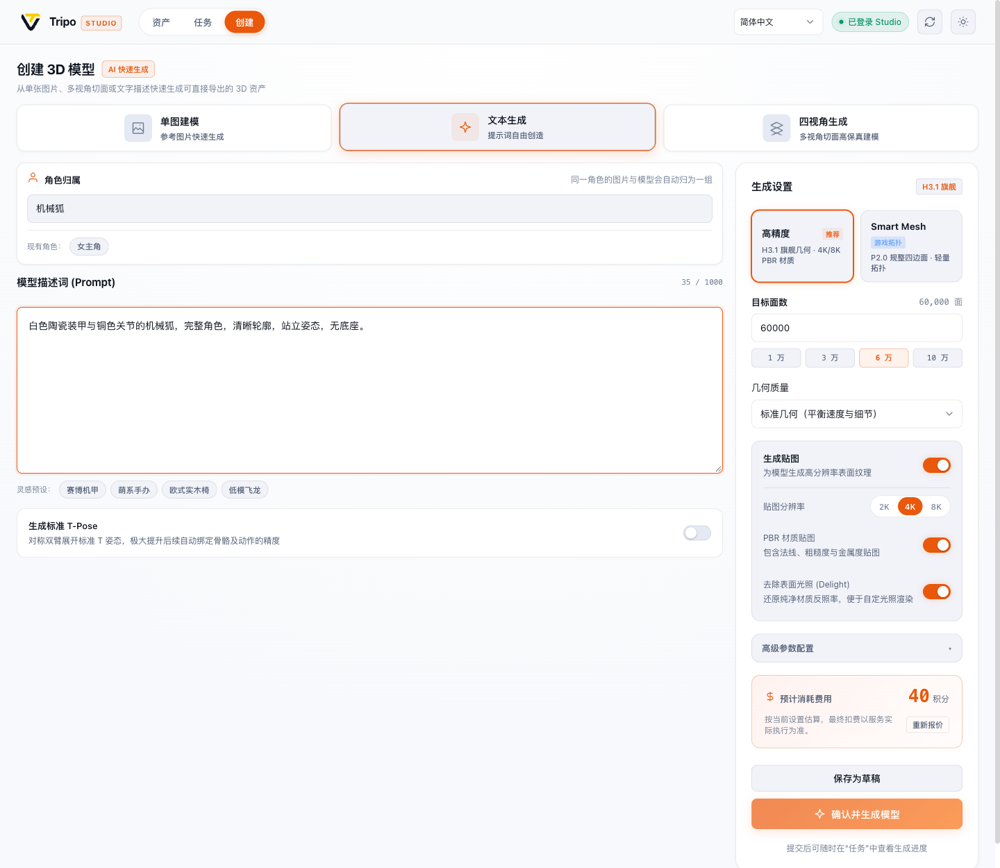

<div align="center">


# Tripo Studio for Codex

**你的对话式 3D 资产工坊。在 Codex 中，用一句话开启全流程 3D 创作。**

*Your one-stop 3D AI studio inside Codex. Describe, sculpt, rig, and export 3D models with one sentence — powered by Tripo Studio & local Blender pipeline.*

<p>
  <a href="#安装与快速上手">= 22" /></a>
  <a href="#安装与快速上手"></a>
  <a href="#核心特性"></a>
  <a href="#本地-blender-工具箱"></a>
</p>

<p>
  
  
  
  
</p>

<p>
  <a href="#为什么需要它"><b>💡 为什么需要它</b></a> ·
  <a href="#核心特性"><b>✨ 核心特性</b></a> ·
  <a href="#使用示例与对话范式"><b>💬 使用示例</b></a> ·
  <a href="#安装与快速上手"><b>🚀 安装上手</b></a> ·
  <a href="#界面画廊"><b>🖼️ 界面画廊</b></a> ·
  <a href="#完整工具清单"><b>🛠️ 工具清单</b></a>
</p>

</div>

---

> [!NOTE]
> 🚀 **零 API 门槛 · 会员直接复用**：直接连接你在 Tripo Studio 网页端的现有会员账号，无需申请与额外购买 Tripo API Key。内嵌 67 个 MCP 工具与可交互式 MCP Apps 工作台，云端积分透明预估，本地 Blender 辅助操作完全零积分消耗！

---

## 为什么需要它 (What it is)

制作 3D 资产以往是一条高度割裂的繁复流水线：
在浏览器网页中输入 Prompt 生成模型 ➔ 手动下载 GLB 导出文件 ➔ 导入 Blender 检查拓扑与面数 ➔ 发现问题反复切换回网页重刷 ➔ 换外部工具绑定骨骼与动作 ➔ 格式转换与贴图烘焙频繁报错。

**Tripo Studio for Codex 将整套 3D 生产管线彻底整合进 Codex 智能体中。**

你只需对 Codex 发送一句自然语言描述，Agent 即可为你设计参数草稿、智能核算积分、调起 Tripo Studio 最新高精度或 Smart Mesh 模型生成；在聊天窗口中直接旋转检视 3D GLB 模型；一键执行拓扑重构、Rig V3 骨骼绑定与动效重定向；本地更内嵌 Blender 引擎，零成本完成几何检查、线框渲染、投影烘焙与多格式交付。

### 三大核心设计原则

1. **双模协同：对话即生成，工作台即控制台** (Agent-Driven & Interactive Workbench)
   不仅能用自然语言向 Agent 发号施令，还能随时打开集成**资产库、任务监控、创建面板**的三合一可视化工作台。聊天中自带 60 秒草稿防手滑确认卡片，直观掌握面数、拓扑与贴图预算。
2. **账号直通：复用 Studio 会员，告别 API 昂贵中转** (BYO Account · Zero API Token Markup)
   直接打通并复用本机的 Tripo Studio 网页会话凭证，享受官方最新的 H3.1、Smart Mesh P2 与 Rig V3 算力，无任何二次计费与代理溢价。
3. **端云闭环：云端生成算力 + 本地 Blender 管线** (Cloud Generation + Local Blender Engine)
   云端专攻高负载几何生成、8K PBR 贴图生成与 AI Motion 动效；本地静默调用 Blender 免费完成几何体素检查、流形修复、贴图投影与 FBX/OBJ/USDZ 交付，不消耗任何云端点数。

---

## 核心特性 (Features)

### 🤖 对话驱动与安全草稿卡片 (Agent & Safe Confirmation)

自然语言直达 3D 生产，同时具备严格的防误触设计与实时 3D 预览：

- **智能参数草稿**：Agent 自动将模糊意图解析为专业 3D 生成配置（模型版本、面数预算、PBR 贴图规格等）。
- **60 秒倒计时防手滑保护**：生成工具默认展示配置卡片与积分预估，进入编辑即暂停倒计时，保存修改重新核算报价，支持立即确认或撤销。
- **可交互 3D GLB 结果卡片**：生成完成后直接在对话流中旋转、缩放检视 3D 模型，后台查询、报价与下载均保留当前预览状态。

<div align="center">
  
</div>

---

### 🎨 三合一可视化工作台 (Interactive Workbench)

通过 `tripo_open_workbench` 或直接对 Codex 说“打开 Tripo 工作台”，即可唤出集成界面：

- **资产中心 (Assets)**：按账号本地保存的模型与图片分组（角色包、场景包），支持 Shift / 点击多选、批量整理与全链路来源追踪。
- **任务中心 (Tasks)**：持久化任务队列与进度同步，支持断线恢复与未完成任务对账。
- **创建面板 (Create)**：支持单图建模、文字建模、四视角参考图建模与 Smart Mesh 多变体预算配置。
- **全平台体验**：深色／浅色主题自适应，支持简体中文、繁體中文、English、日本語多语言实时切换。

<table width="100%">
  <tr>
    <th width="50%">深色工作台创建页</th>
    <th width="50%">浅色工作台创建页</th>
  </tr>
  <tr>
    <td></td>
    <td></td>
  </tr>
</table>

---

### ⚡ 全矩阵 3D 生产力 (Comprehensive 3D Pipeline)

涵盖从概念设计到动画交付的完整 3D 资产链条：

- **High Detail 建模**：支持 H2.5 / H3.0 / H3.1 架构，支持指定目标面数、几何质量与 2K / 4K / 8K PBR 贴图。
- **Smart Mesh P2 游戏拓扑**：严苛多边形预算（500–25,000 面），规整四边形拓扑，支持同时输出 1 / 2 / 4 个不同面数预算变体。
- **多视角与独立批量**：支持四视角（前/后/左/右）参考图建模；独立批量生成每批最多 30 张图，配合变体最高支持 120 个输出位。
- **骨骼与动画系统**：Rig V3 自动骨架绑定、人形骨架预设、动作预设，以及 AI Motion 动效生成与双足模型动作重定向。
- **模型后处理工坊**：外部模型导入、分件（Segment）、部件补全、重拓扑（Remesh）、Smart UV 候选生成与贴图放大。

---

### 🛠️ 本地 Blender 工业级工具箱 (Local Tools · 零积分消耗)

本地工具箱完全离线运行，**不消耗任何 Studio 积分，无需登录，不上传任何输入资产**：

- **几何健康检查**：检查自包含 GLB 网格结构、流形状态与面数体素分布。
- **线框与视图渲染**：一键生成无光照线框图与模型多角度渲染图。
- **贴图投影烘焙**：将 2D 参考图精准投影并烘焙到模型贴图表面。
- **工业格式无损导出**：自有项目导出为 GLB / FBX (Blender 预设) / OBJ / USDZ / STL / 3MF，并自动下载生成 meshopt GLB 解码副本。

---

## 使用示例与对话范式 (Showcase & Prompts)

安装后，直接向 Codex 提出需求。使用参考图时，先附上图片或提供可读取的本地文件路径：

```text
用这张参考图生成「机械狐」模型：H3.1、标准几何、60,000 面、4K PBR 贴图。
只准备配置草稿，设置 review:false、submit:false，先不要提交。
```

> **对话提交语义**：聊天中的生成／编辑工具默认展示配置卡片，并在 60 秒后自动提交。进入编辑会暂停倒计时，保存修改后重新报价并重启倒计时；也可立即确认或取消。指定草稿模式只保存配置，后续明确确认即可执行。

### 常用场景与指令范例

| 实战场景 | 对 Codex 说 | 涉及能力 |
| --- | --- | --- |
| **🎮 严格网格预算** | “用这张图做 Smart Mesh P2 模型，给我 5,000 和 10,000 面两个变体，只准备草稿。” | Smart Mesh P2、多变体预算 |
| **📐 多视图一致建模** | “这四张图依次是正面、左侧、背面、右侧，用它们生成同一个模型，只准备草稿。” | 多视角建模、四视图对齐 |
| **🏃 角色骨骼与动作** | “检查机械狐模型的绑定能力，使用适合它的骨架，再应用一个可用的走路动画。” | Rig V3、骨骼绑定、AI Motion |
| **📦 资产分组与归档** | “把选中的参考图和模型收进一个组，命名为「机械狐 · 游戏资产」，检查组内数量。” | 本地资产分组、多选整理 |
| **🔍 全链路来源溯源** | “查看这个模型的来源任务、输入图片与实际生成参数。” | 任务血统追踪、输入回溯 |
| **🚀 Blender 格式交付** | “导出这个自有项目为 FBX，使用 Blender 预设、2K 贴图，下载后展示文件位置。” | 模型导出、贴图打包、格式兼容 |

---

## 安装与快速上手 (Quick Start)

### 1. 环境准备

- **Node.js ≥ 22**
- 支持 MCP Apps 的 Codex（完整插件体验需要宿主支持 Plugin 扩展）
- 自己的 **Tripo Studio 会员账号**（浏览器登录会话）
- *（可选）* **Blender**：用于本地几何检查、线框渲染与投影烘焙；纯云端生成不依赖 Blender

### 2. 安装与接入

可以选择以下任意一种方式接入（二选一）：

#### 方式 A：从源码连接 MCP（推荐开发者）

```bash
# 1. 克隆代码仓库
git clone https://github.com/GrinZero/tripo-studio-plugin.git
cd tripo-studio-plugin

# 2. 安装依赖并构建
npm ci
npm run build

# 3. 将 MCP 服务注册到 Codex
codex mcp add tripo-studio -- node "$(pwd)/mcp/bootstrap.mjs"
```

#### 方式 B：从本地市场添加插件（完整插件生态）

如果 Codex 已配置包含本项目的 `tripo-studio-local` 本地市场：

```bash
codex plugin add tripo-studio-plugin@tripo-studio-local
```

### 3. 会话登录与工作台唤起

1. **登录验证**：对 Codex 说：“检查 Tripo Studio 登录状态，需要的话帮我登录。”
   - 已有浏览器登录会自动复用会话；若未登录将自动打开官方登录页。
2. **打开工作台**：对 Codex 说：“打开 Tripo 工作台。”
   - 包含**资产、任务、创建**三个主入口，打开本身不产生任何费用。
3. **开始创作**：在创建面板或直接在聊天中发送你的 3D 描述，享受丝滑的 3D 生成体验！

> 默认资产存储路径为 `~/Documents/TripoStudio`，可通过 [配置说明文档](docs/CONFIGURATION.md) 自定义。

---

## 界面画廊 (Showcase Gallery)

<table width="100%">
  <tr>
    <td width="50%" align="center">
      <b>资产分组卡片（名称、成员预览与数量）</b><br/>
      
    </td>
    <td width="50%" align="center">
      <b>资产直接多选与批量分组操作栏</b><br/>
      
    </td>
  </tr>
  <tr>
    <td width="50%" align="center">
      <b>深色参数配置卡片（编辑中暂停倒计时）</b><br/>
      
    </td>
    <td width="50%" align="center">
      <b>浅色参数配置卡片（可编辑参数与预估积分）</b><br/>
      
    </td>
  </tr>
  <tr>
    <td width="50%" align="center">
      <b>模型详情与重拓扑参数面板</b><br/>
      
    </td>
    <td width="50%" align="center">
      <b>日本語窄面板自适应布局</b><br/>
      
    </td>
  </tr>
</table>

*注：界面截图均取自当前版本真实运行环境与 Studio 资产。截图来源与数据哈希见 [截图来源记录](docs/images/README.md)。*

---

## 完整工具清单 (67 MCP Tools Architecture)

服务器注册了 **63 个智能体可见工具** 与 **4 个应用专属工具**：

```text
┌─────────────────────────────────────────────────────────────┐
│                    Tripo Studio for Codex                   │
├─────────────────┬──────────────────────┬────────────────────┤
│ 🖥️ Workbench (1)│ 👤 Session & Auth (5)│ 📚 Catalog Read(10)│
│ 工作台视图路由  │ 登录、状态、支付摘要 │ 模型、图片、动作等 │
├─────────────────┼──────────────────────┼────────────────────┤
│ ⚙️ Operations(28)│ 📦 Asset Groups (5) │ 📋 Task Engine (9) │
│ 云端生成/后处理 │ 资产多选、分组管理   │ 提交、同步、溯源   │
│ 本地 Blender/UV │ 纯本地、零积分消耗   │ 状态恢复与对账     │
└─────────────────┴──────────────────────┴────────────────────┘
```

| 模块分类 | 包含工具 | 核心能力说明 |
| --- | --- | --- |
| **🖥️ Workbench (1)** | `tripo_open_workbench` | 打开工作台侧边栏或对话面板，支持路由定位，不提交付费生成 |
| **👤 账号与会话 (5)** | `tripo_auth_status`, `tripo_auth_login`, `tripo_auth_import`, `tripo_auth_logout`, `tripo_get_payment` | 浏览器会话继承、凭证状态检视、会员套餐与积分额度查询 |
| **📚 目录与读取 (10)** | `tripo_list_models`, `tripo_get_model`, `tripo_list_image_assets`, `tripo_get_image_asset`, `tripo_list_image_templates`, `tripo_list_animation_presets`, `tripo_list_operations`, `tripo_list_motions`, `tripo_get_motion`, `tripo_get_uv_context` | 分页读取模型详情、图片资产、动作预设、操作目录与 Smart UV 上下文 |
| **⚙️ 云端生成与编辑 (22)** | `tripo_generate_image`, `tripo_generate_multiview`, `tripo_regenerate_image`, `tripo_generate_model`, `tripo_import_model`, `tripo_segment_model`, `tripo_complete_parts`, `tripo_remesh_model`, `tripo_generate_texture`, `tripo_preview_texture_edit`, `tripo_apply_texture_edits`, `tripo_upscale_texture`, `tripo_generate_pbr`, `tripo_rig_model`, `tripo_animate_model`, `tripo_upscale_image`, `tripo_split_image`, `tripo_generate_motion`, `tripo_apply_motion`, `tripo_export_model`, `tripo_generate_uv`, `tripo_apply_uv` | High Detail 建模、Smart Mesh P2、多视角、分件补全、贴图/PBR、Rig V3 绑定、AI Motion 动效 |
| **🛠️ 本地处理 (6)** | `tripo_render_model`, `tripo_inspect_local_parts`, `tripo_edit_parts`, `tripo_bake_texture_projection`, `tripo_paint_texture`, `tripo_crop_image` | **零积分消耗**：Blender 本地网格检查、线框渲染、部件编辑、贴图投影烘焙、UV 绘制与图片裁剪 |
| **📦 资产分组 (5)** | `tripo_list_asset_groups`, `tripo_list_group_assets`, `tripo_create_asset_group`, `tripo_set_asset_group`, `tripo_rename_asset_group` | **零积分消耗**：按账号本地维护角色/资产分组，支持多选、移动、重命名与移出 |
| **📋 任务与血统追踪 (9)** | `tripo_submit_task`, `tripo_task_sync`, `tripo_task_wait`, `tripo_task_cancel`, `tripo_task_reconcile`, `tripo_list_tasks`, `tripo_get_task`, `tripo_list_task_groups`, `tripo_set_task_character` | 精确执行暂存草稿、超时等待、任务进度同步、未完成对账、角色归属与输入来源全生命周期追溯 |

*详细参数说明、输入类型及默认值见 [TOOL_INVENTORY.md](TOOL_INVENTORY.md) 与 [docs/USAGE.md](docs/USAGE.md)。*

---

## 使用限制与工程边界 (Engineering Boundaries)

- **验证范围**：本项目基于 Tripo Studio 客户端网络契约实现。契约与自动化测试通过不代表每项付费操作都完成了真实扣费验证；浏览器宿主验证与原生 Codex 宿主验证分别记录，详见 [验证记录索引 (CONTRIBUTING.md)](CONTRIBUTING.md#验证记录)。
- **导出与下载限制**：导出功能限用户自有项目。需先调用导出并指定格式，再下载对应的导出结果；直接修改本地文件扩展名无法转换格式。贴图打包可能返回 ZIP 压缩包，实际分辨率在下载阶段核验。
- **本地模型处理边界**：本地处理要求自包含 GLB 格式；Blender 自动解码受 150 MiB 本地模型尺寸限制；UV 利用率为空间估算值；投影烘焙以面中心判定可见性，复杂材质与大面角需复核；蒙皮部件的拓扑结构修改会被拒绝。
- **来源追踪与恢复**：来源追溯依赖插件本地持久化的任务与输入记录，无法自动补齐在插件外部进行的网页端编辑；遇到 `outcome_unknown` 异常任务需核对远端 ID，不可盲目重复提交。

---

## 文档导航 (Documentation)

- 📖 **[使用指南 (docs/USAGE.md)](docs/USAGE.md)**：详细参数选择、提交行为、草稿确认、任务恢复与导出步骤
- 🛠️ **[完整工具清单 (TOOL_INVENTORY.md)](TOOL_INVENTORY.md)**：全 67 个 MCP 工具的参数细节、积分标记与调用规范
- ⚙️ **[配置说明 (docs/CONFIGURATION.md)](docs/CONFIGURATION.md)**：环境变量、本地数据目录与跨平台 Blender 路径配置
- 💻 **[参与开发与验证规范 (CONTRIBUTING.md)](CONTRIBUTING.md)**：构建、测试、分发打包、架构说明与验证用例索引
- 🧠 **[核心架构文档 (CORE.md)](CORE.md)**：底层设计哲学、会话管理与端云通信架构
- 🤖 **[Agent 技能指引 (skills/tripo-studio/SKILL.md)](skills/tripo-studio/SKILL.md)**：针对 AI 智能体的调用指导与最佳工作流实践

---

## 许可证 (License)

当前插件清单声明为 `UNLICENSED`。仓库未包含开源 `LICENSE` 文件，未授予开源许可。详见 [插件清单 (.codex-plugin/plugin.json)](.codex-plugin/plugin.json)。
