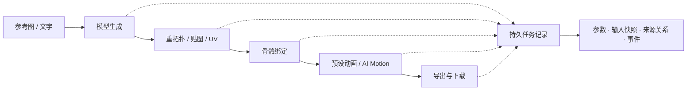

# Tripo Studio for Codex

**在 Codex 中，用一句话开始你的 3D 创作。**

把参考图、文字描述和已有资产变成可继续编辑、绑定、制作动画与导出的 3D 模型。Tripo Studio 插件将自然语言操作、可视化工作台和持久任务记录接在一起，让你在同一个创作流程中完成生成、整理与交付。

**复用 Studio 会员账号 · 无需 Tripo API Key · 28 种操作 · 67 个 MCP 工具 · 四语言界面**

当前版本 **0.3.3**，其中 63 个工具供 agent 使用，4 个工具服务于应用界面。


*本次重新截取的创建页：输入「机械狐」描述，设置 H3.1、6 万面与 4K PBR，查看实时积分预估。*

[核心功能](#核心功能) · [创作示例](#你可以这样开始) · [快速开始](#快速开始) · [完整能力](#完整能力一览) · [开发与配置](#开发与配置)

## 核心功能

### 1. 对话操作与可视化工作台，接续同一份资产

告诉 Codex 你要做什么，也可以打开工作台直接选图、调参数和查看模型。独立工具、工作流和工作台共用操作注册表及任务记录：在聊天中创建的任务，可以继续在工作台查看参数、结果和下载记录。

工作台提供三类入口：**资产、任务、创建**。模型详情支持旋转、缩放、重置视角、材质与线框切换，并展示实际网格的三角面数与分件；重拓扑、贴图、绑定和导出可以继续从已有模型发起。

> “用这张参考图生成一个带 4K PBR 贴图的模型，角色名叫「机械狐」。完成后展示预览。”

结果卡片直接展示图片或可交互的 GLB。查询账号、报价、同步任务和后台下载会保留当前预览；匹配的下载记录在预览下方更新，保留已有视角。


*本次下载的实际 Studio 模型：卡片展示可旋转的 GLB、13.4 MB 文件规格、保存位置与解码后的 Blender 兼容文件。*

### 2. 从文字、单图、多视图到批量建模

根据用途选择生成路线，而不必把所有资产做成同一种规格。

| 创作路线 | 可以配置什么 | 适用场景 |
| --- | --- | --- |
| **High Detail** | H2.5 / H3.0 / H3.1；H3.1 独立几何质量；目标面数、2K / 4K / 8K 贴图、PBR、去光照与分件等受支持组合 | 角色、道具与需要表面细节的资产 |
| **Smart Mesh P2** | 500–25,000 目标面数、四边形拓扑、1 / 2 / 4 个变体与各自面数预算 | 需要控制网格预算的游戏资产 |
| **多视图建模** | 本地固定视角图片或已有 Studio 多视图资产 | 用同一物体的不同视角生成一个模型 |
| **独立批量建模** | 每批最多 30 张图片；配合变体最多 120 个输出位 | 为一组不同输入分别创建模型 |

Smart Mesh 聚焦几何与拓扑，不提供 High Detail 的贴图生成参数。独立批量中的每张图分别生成模型；多视图则将同一物体的多个视角用于一个模型。界面和工具会校验参数组合。

图片链路也包含在插件中：**生成／编辑参考图 → 四视图生成 → 建模**。支持 GPT Image 2.5 等已接入模型、本地与 Studio 图片引用、重新生成、4K 放大和自动主体切出。

### 3. 按角色整理资产，agent 与工作台共同管理

同一角色的参考图、模型和后续处理产物，可以沿已记录的任务来源继承角色归属。创建时给出角色名，后续操作引用来源任务或已记录的输出，便能延续同一组。

资产库把分组显示为一张卡片：**成员预览拼图、分组名称、完整成员数量**。模型与图片可以属于同一个组，并分别在两个资产页查看。


*本次读取的真实 Studio 资产，按「角色」和「场景」在临时本地目录中分组；数量按完整分组统计。*

卡片支持直接点击多选、跨页保留选择、创建分组、加入已有分组和移出分组。agent 也能查询、创建、移动成员与重命名，工作台读取同一份归属数据。


*本次实际点击选中两个已有模型，展示创建分组、加入分组和取消选择的操作栏。*

> “把「机械狐」的参考图和模型收进一个组，命名为「机械狐 · 游戏资产」。”

分组按 Studio 账号隔离并保存在本地。整理分组不消耗 Studio 积分；重命名保留组 ID 和成员；移出分组保留原资产。角色归属依据明确名称和任务来源，不依赖视觉识别猜测。

### 4. 可编辑参数卡片与积分预估

生成和编辑工具默认先展示配置卡片：输入缩略图、模型版本、面数、几何质量、贴图与 PBR 设置、预估费用都可查看。修改参数会重新校验和报价，防止用旧报价提交新配置。

| 深色配置卡片 | 浅色配置卡片 |
| --- | --- |
|  |  |

*本次使用已有 Studio 图片准备配置，读取实际报价，并进入编辑暂停自动提交。截图中的 40 积分对应当时配置，不是固定价格。*

**默认卡片会在 60 秒后自动提交。** 你可以立即确认、取消，或进入编辑暂停倒计时；保存修改后重新报价并重启倒计时。只想保存草稿时，使用 `review:false, submit:false`。明确直接执行时，可使用 `submit:true`。

工作台使用独立的草稿与提交确认流程：修改配置后旧报价失效，提交时展示本次冻结参数。积分预估可结合账号会员折扣和试用信息；最终扣费以 Studio 为准。

### 5. 继续处理模型：拓扑、材质、UV、骨骼与动作

已有模型可以进入完整的后处理链，逐步达到目标用途需要的规格。

| 环节 | 核心能力 |
| --- | --- |
| **网格与部件** | 模型导入、语义分件、部件补全、重拓扑与面数控制 |
| **材质** | 贴图生成、编辑预览与应用、贴图放大、PBR 材质 |
| **Smart UV** | 查看 UV 上下文，生成／重试候选，下载候选 GLB 和 UV 布局，再单独应用 |
| **自动绑定** | Rig V3，支持 ActorCore / Mixamo / Unreal / VRM / Unity 人形骨架预设；保留旧版绑定选项 |
| **预设动画** | 查询可用预设，再为模型应用动画 |
| **AI Motion** | 文本描述动作，1–5 个阶段、每阶段 1–10 秒，可配置连续路径点；生成后重定向到受支持的双足绑定模型 |

各操作先检查目标模型的实际能力和前置条件。Smart UV 的候选生成与应用分开，可以先检查候选，再替换当前模型。


*本次加载的真实岩石模型与二次处理面板：可调整目标面数和拓扑，先查看报价，再确认处理。*

### 6. 任务可追踪，跨步骤保留来源

每次操作都对应稳定的本地任务 ID，并保存实际参数、输入快照及哈希、远端项目／操作／资产关联、事件与下载记录。任务中心可按状态查看进度和结果，插件重启后仍可读取既有记录。



*这是插件支持的处理链示意；可执行步骤取决于模型能力，各步使用独立任务记录。*

`tripo_run_workflow` 可衔接项目、动作资产、UV 候选、本地模型、渲染相机和烘焙贴图等上游输出。

> “这个模型用了哪张参考图？生成时是什么参数？接着上次的结果继续处理。”

请求结果不明时，任务记录为 `outcome_unknown`，通过核对远端 ID 恢复，不自动重复提交。生成完成与下载完成分别记录，下载失败后仍可继续获取已有产物。

### 7. 多格式交付与本地 Blender 编辑

自有 Studio 项目支持 **GLB / FBX / OBJ / USDZ / STL / 3MF** 导出。可配置贴图尺寸与打包方式、骨架、选定动画、UV 打包、FBX 预设、原地动画、帧烘焙，以及 OBJ 顶点颜色等选项。

下载保留源文件。meshopt 压缩 GLB 可生成独立的解码副本，便于交给 Blender；ZIP／GLB 中超过请求尺寸的贴图在下载时进行本地降采样，并记录实际尺寸与哈希。

本地处理由后台 Blender 与图像工具完成：

- **检查与渲染**：读取部件、估算各部件 UV 利用率、生成 2× 视口渲染及相机参数。
- **几何编辑**：在模型副本中合并、隐藏、删除部件，或按面索引手动分离。
- **贴图编辑**：UV 笔划绘制、编辑图投影与按部件烘焙，再衔接贴图应用。
- **图片裁切**：按明确像素矩形生成副本，保留原图。

这 6 种本地操作无需登录、不上传输入，也不消耗 Studio 积分。Blender 模型操作使用自包含 GLB，源文件保留。

> “把这个模型导出为 FBX，使用 Blender 预设，贴图限制为 2K，并保存到本地。”

先用 `tripo_export_model` 指定格式，完成后用 `tripo_download` 下载该导出任务。贴图打包选项可能返回包含模型和贴图的 ZIP；修改下载扩展名不会转换模型格式。

### 8. 复用会员登录，适配语言、主题与窄面板

插件使用你自己的 **Tripo Studio 会员会话**。已有有效浏览器登录时直接复用；需要登录时打开一次官方登录页面。获取会话后，操作以 headless 方式运行，浏览器可以关闭，无需另行准备 Tripo API Key 或常驻网页。

工作台与配置／结果／报价卡片支持 **简体中文、繁體中文、English、日本語**。默认跟随宿主或浏览器，支持手动切换；切换语言保留表单输入和已有提交期限。主题支持跟随宿主／系统、浅色与深色，布局适配侧边窄面板。

| 浅色工作台 | 日本語窄面板 |
| --- | --- |
|  |  |

*本次重新截取的浅色创建页与日语窄面板，使用同一版本的工作台界面。*

## 你可以这样开始

以下是对话请求示例，多步生成与处理可能消耗 Studio 积分。Codex 会依据输入、实时能力和可用参数选择工具。

| 目标 | 对 Codex 说 |
| --- | --- |
| 从参考图建模 | “用这张图生成机械狐，H3.1、标准几何、4K PBR 贴图。先让我查看配置。” |
| 生成游戏用网格 | “用这张图做 Smart Mesh P2 模型，给我 5,000 和 10,000 面两个变体。” |
| 用多视图建模 | “这四张图依次是正面、左侧、背面、右侧，用它们生成同一个模型。” |
| 延续角色制作 | “继续机械狐的模型，检查绑定能力，使用 Unity 人形骨架预设，再应用一个可用的走路动画。” |
| 整理素材 | “列出机械狐组里的所有模型和图片，把选中的素材移到「机械狐 · 最终版」。” |
| 追查来源 | “查看这个模型的来源任务、输入图片与实际生成参数。” |
| 保存草稿 | “准备生成配置，设置 review:false、submit:false，只保存草稿。” |
| 导出交付 | “导出这个自有项目为 FBX，使用 Blender 预设，贴图 2K，下载后展示文件位置。” |

## 快速开始

### 准备与安装

需要 **Node.js ≥ 22**、支持插件和 MCP Apps 的 Codex，以及一个用于远端操作的 Tripo Studio 账号。后台 Blender 检查、渲染、几何编辑和投影烘焙另需安装 Blender；云端生成与资产管理不依赖 Blender。

在源码目录安装依赖并构建：

```bash
npm install
npm run build
```

项目通过 `.codex-plugin/plugin.json` 和 `.mcp.json` 注册。如果你的 Codex 已配置包含本项目的 `tripo-studio-local` 本地市场，可安装或更新：

```bash
codex plugin add tripo-studio-plugin@tripo-studio-local
```

上述命令依赖已配置的本地市场；该名称不是公共市场地址。安装／更新后重新加载插件的 MCP 连接，并重新打开工作台，载入新工具与界面。

### 登录与首次创作

1. 在 Codex 中说：“检查 Tripo Studio 登录状态，需要的话帮我登录。”
2. 说：“打开 Tripo 工作台。”也可使用宿主侧栏或对话面板中的 Tripo Studio 应用入口，具体位置取决于宿主版本。
3. 选择单图、文字或多视图，填写角色名与生成参数，查看报价。打开工作台本身不会提交生成任务。
4. 从工作台确认提交，或使用聊天中的配置卡片。聊天卡片默认 60 秒自动提交，编辑可暂停，取消可终止。
5. 完成后检查模型，继续处理或导出下载。默认资产目录为 `~/Documents/TripoStudio`。

会话有效时，后续操作无需保持浏览器打开。Windows Chrome 的 app-bound Cookie 无法直接读取时，可使用 Firefox；无浏览器环境另有 `tripo_auth_import` 会话导入工具。

## 完整能力一览

| 能力 | 代表工具 | 输出或作用 |
| --- | --- | --- |
| 账号与报价 | `tripo_auth_login`、`tripo_get_payment`、`tripo_quote_operation` | 会员会话、账号积分与操作费用预估 |
| 图片创作 | `tripo_generate_image`、`tripo_generate_multiview`、`tripo_regenerate_image`、`tripo_upscale_image`、`tripo_split_image` | 参考图、多视图、放大与主体切出 |
| 3D 生成 | `tripo_generate_model` | 文字／图片／多视图／独立批量模型 |
| 网格处理 | `tripo_import_model`、`tripo_segment_model`、`tripo_complete_parts`、`tripo_remesh_model` | 导入、分件、补全与重拓扑 |
| 材质处理 | `tripo_generate_texture`、`tripo_preview_texture_edit`、`tripo_apply_texture_edits`、`tripo_upscale_texture`、`tripo_generate_pbr` | 贴图、编辑候选、放大与 PBR |
| Smart UV | `tripo_get_uv_context`、`tripo_generate_uv`、`tripo_apply_uv` | UV 上下文、候选与应用 |
| 骨骼与动作 | `tripo_rig_model`、`tripo_animate_model`、`tripo_generate_motion`、`tripo_apply_motion` | 骨架、预设动画、生成动作与重定向 |
| 共享资产分组 | `tripo_list_asset_groups`、`tripo_list_group_assets`、`tripo_create_asset_group`、`tripo_set_asset_group`、`tripo_rename_asset_group` | 查询、创建、归组、移出与改名 |
| 任务与工作流 | `tripo_get_task`、`tripo_task_sync`、`tripo_task_wait`、`tripo_run_workflow` | 进度、参数、来源与跨步骤衔接 |
| 本地编辑 | `tripo_inspect_local_parts`、`tripo_render_model`、`tripo_edit_parts`、`tripo_bake_texture_projection`、`tripo_paint_texture`、`tripo_crop_image` | 本地检查、渲染、几何与图像副本 |
| 展示与交付 | `tripo_open_workbench`、`tripo_show_result`、`tripo_export_model`、`tripo_download`、`tripo_open_in_studio` | 工作台、结果卡片、文件与 Studio 项目入口 |

这是按用途整理的代表工具。通过 `tripo_list_operations` 查询全部 28 种操作及 `consumes_credits` 标记；完整参数以当前 MCP 工具 schema 为准。

## 开发与配置

```bash
npm run build
npm test
```

`mcp/bootstrap.mjs` 优先加载 `dist/server.mjs`。修改源码后需重新构建；开发时可用 `npm run serve:src` 启动源码版本。分发时需要包含插件配置、`mcp/`、`dist/`、`ui/`、`skills/`、`scripts/blender-worker.py` 和运行时依赖。

测试覆盖操作契约、任务恢复、来源快照、多输出身份、报价、资产分组、界面与真实 stdio MCP 握手。Blender 集成测试在安装 Blender 时运行，否则明确跳过。

<details>
<summary>环境变量与本地数据</summary>

| 变量 | 用途 |
| --- | --- |
| `TRIPO_PLUGIN_DATA_DIR` | 会话、任务、快照、分组与锁；macOS 默认 `~/Library/Application Support/TripoStudioPlugin` |
| `TRIPO_ASSET_ROOT` | 下载和本地产物根目录；默认 `~/Documents/TripoStudio` |
| `TRIPO_OUTPUT_ROOTS` | 允许写入的输出目录列表，以平台路径分隔符分隔；默认使用资产根目录 |
| `TRIPO_BROWSER_PROFILE_DIR` | 显式指定浏览器 Cookie 存储根目录 |
| `TRIPO_BLENDER_EXECUTABLE` | Blender 可执行文件；macOS 默认 `/Applications/Blender.app/Contents/MacOS/Blender`，其他平台默认 `blender` |
| `TRIPO_DEVICE_ID` | 覆盖本机稳定设备 ID |
| `TRIPO_PLAN_TTL_MS` | 草稿有效期，默认 30 分钟 |
| `TRIPO_REQUEST_TIMEOUT_MS` | 请求超时，默认 60 秒 |

已保存的本地 `settings.json` 中的 `asset_root` 优先于 `TRIPO_ASSET_ROOT`。会话与任务目录应保留，以便重启后延续任务记录。公开结果和日志经过脱敏；签名下载链接在服务端解析。

</details>

<details>
<summary>工具调用与提交语义</summary>

```text
tripo_auth_status / tripo_auth_login
        ↓
tripo_list_operations / tripo_get_model / tripo_quote_operation
        ↓
生成或编辑工具
        ├─ 默认：配置卡片 → 确认或 60 秒后自动提交
        ├─ review:false, submit:false：仅准备草稿
        └─ submit:true：准备并直接执行
        ↓
tripo_task_sync / tripo_task_wait
        ↓
tripo_show_result / tripo_export_model / tripo_download
```

仅草稿模式下，使用 `tripo_submit_task` 与该任务返回的精确确认信息执行。工作流的 `submit` 默认值为 `true`，会执行到达的步骤；操作的积分属性由共享注册表决定。

`parent_task_id` 连接来源任务，`character_name` 指定或覆盖角色归属。工作流可用 `render_from_previous` 延续相机／视口参数，用 `textures_from_previous` 将本地烘焙结果衔接到贴图应用。

</details>

## 实现范围与验证

本项目基于 Studio 客户端契约实现。已核对契约与自动化测试的能力，不等于每种付费操作都完成了真实计费端到端验证。

- **实际验证**：浏览器会话复用、资产读取、早期图片生成与下载、自有模型 FBX 导出及 Blender 重新导入、1K／2K／4K 导出贴图检查，以及本地 Blender 编辑与烘焙。
- **界面验证**：标准 MCP Apps bridge 与隔离浏览器宿主覆盖参数卡片、报价失效、分组操作、多语言和窄屏布局。本文 9 张截图均于 2026-10-09 重新截取，运行当前版本界面，读取真实 Studio 资产与报价；分组保存在临时本地目录，详见[截图来源](docs/images/README.md)。浏览器验收与原生 Codex 宿主验收分别记录。
- **当前边界**：本地 UV 利用率是估算；投影烘焙按面中心处理可见性，复杂材质与大三角形需检查结果；蒙皮部件的结构编辑被拒绝。Blender 自动解码受 150 MiB 本地模型限制，解码失败时仍保留成功下载的源文件和错误说明。

更多实现与验证记录：

- [Agent 使用指南](skills/tripo-studio/SKILL.md)
- [核心架构](CORE.md) · [能力覆盖](docs/COVERAGE.md)
- [资产分组管理工具](docs/ASSET_GROUP_TOOLS_2026-10-09.md) · [分组卡片与多选](docs/ASSET_GROUP_CARDS_2026-10-09.md) · [角色来源继承](docs/CHARACTER_GROUPING_0_3_1.md)
- [提交前配置卡片](docs/CONFIRMATION_CARD_0_3_1.md) · [报价机制](docs/PRICING_QUOTES_2026-10-08.md) · [预览持久化](docs/PREVIEW_PERSISTENCE_2026-10-09.md)
- [多语言界面](docs/MULTILINGUAL_UI_2026-10-09.md) · [导出贴图验证](docs/EXPORT_RESOLUTION_FIX_2026-10-08.md) · [能力契约与本地处理验证](docs/CAPABILITY_UPDATE_2026-10-08.md)
