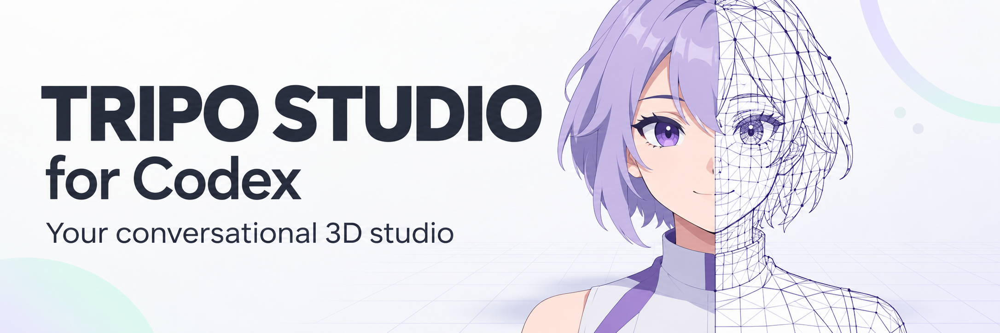
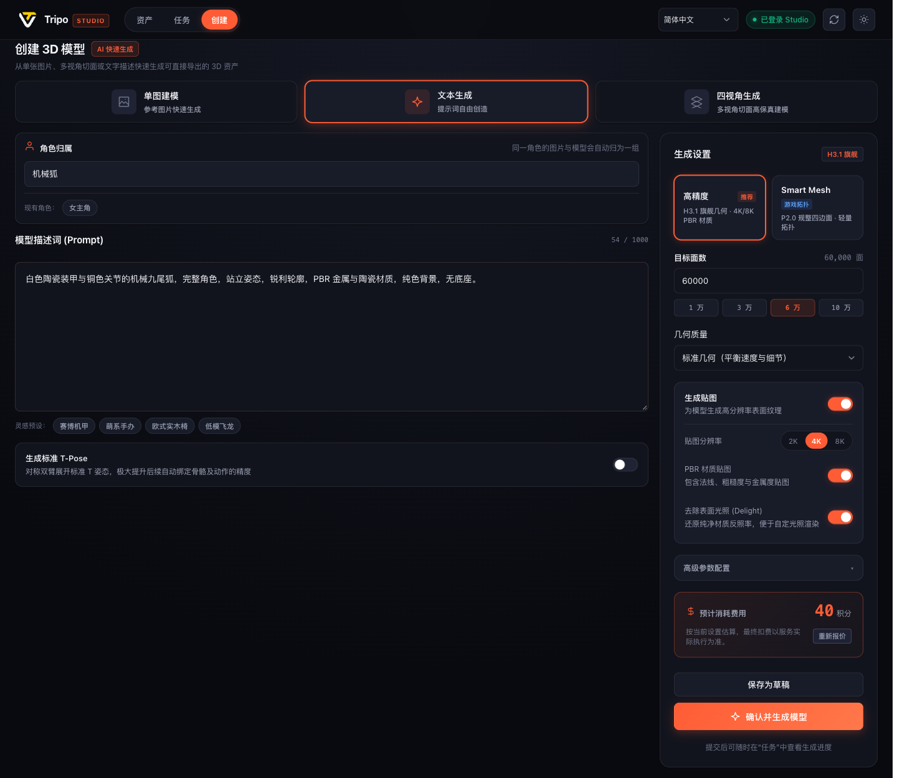
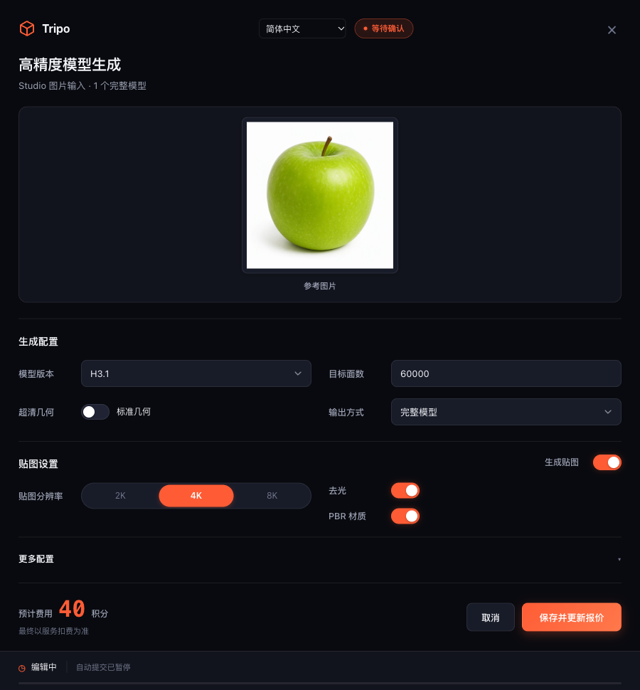
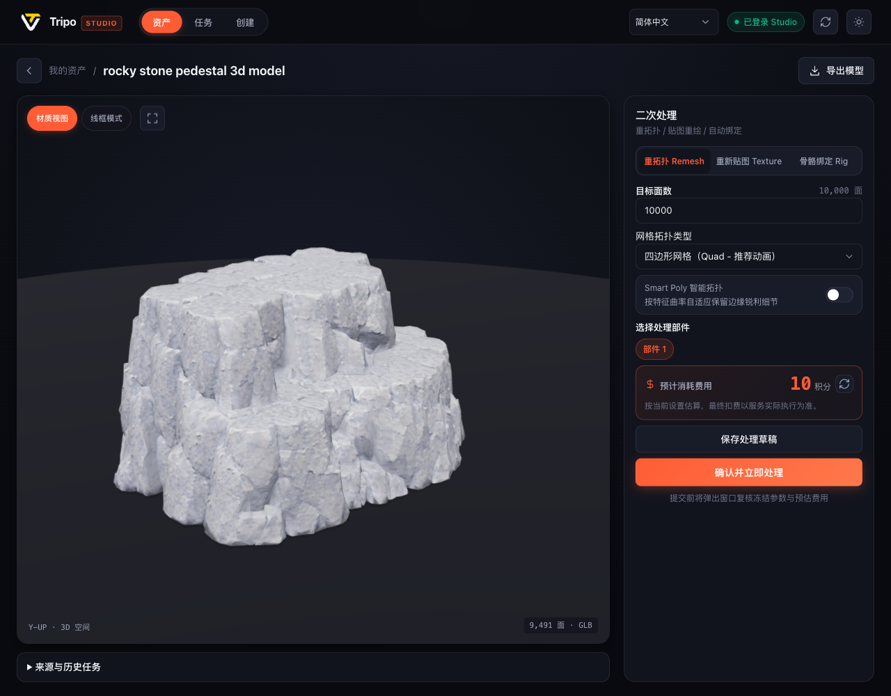
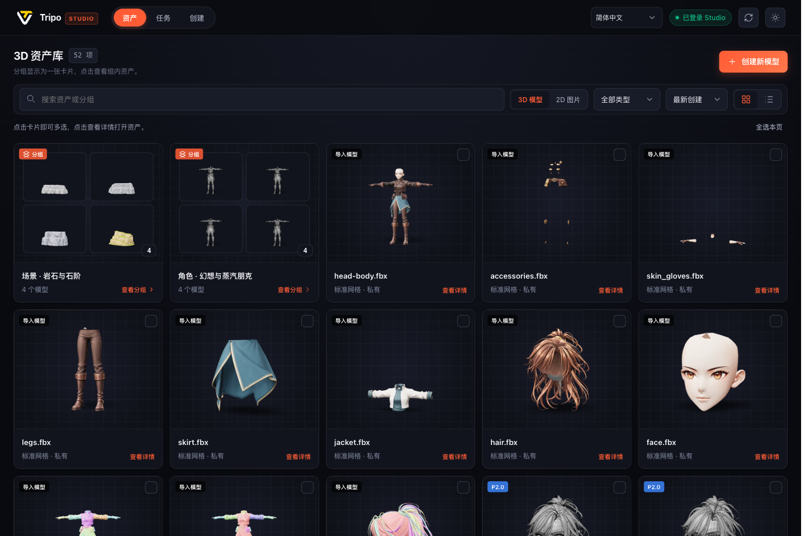
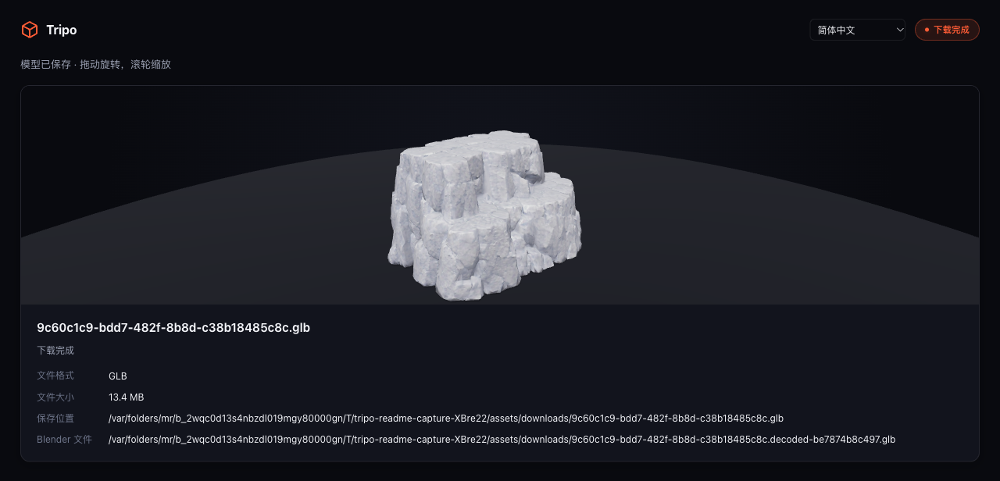
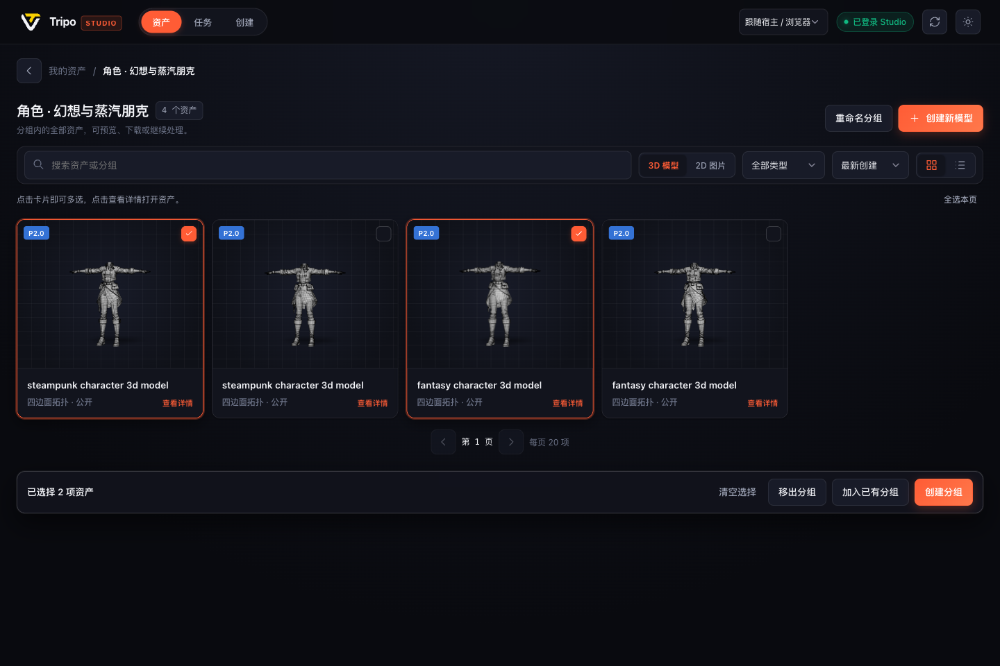
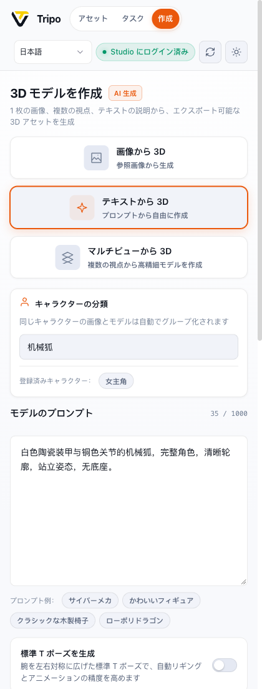

<div align="center">



<p align="center">
  <a href="README.md"><b>简体中文</b></a> ·
  <a href="README.zh-TW.md"><b>繁體中文</b></a> ·
  <a href="README.en.md"><b>English</b></a> ·
  <a href="README.ja.md"><b>日本語</b></a> ·
  <a href="README.ko.md"><b>한국어</b></a>
</p>

# Tripo Studio for Codex

**你的专属独立 3D 资产工坊。在 Codex 中，用一句话开启从概念到绑定的全流程 3D 资产生产。**

*Your own one-person 3D studio. Everything you need to create 3D assets with AI, right inside Codex. Bring your own Tripo Studio account.*

<p align="center">
  <a href="#2-安装与快速上手-quick-start"></a>
  <a href="https://www.npmjs.com/package/tripo-studio-plugin"></a>
  <a href="https://github.com/GrinZero/tripo-studio-plugin"></a>
  <a href="#3-完整工具矩阵与功能清单-67-mcp-tools"></a>
</p>

<p align="center">
  
  
  
  
  
  
  
</p>

<p align="center">
  <a href="#1-什么是-tripo-studio-for-codex-what-it-is"><b>💡 什么是它</b></a> ·
  <a href="#2-安装与快速上手-quick-start"><b>🚀 安装上手</b></a> ·
  <a href="#3-完整工具矩阵与功能清单-67-mcp-tools"><b>🛠️ 工具清单</b></a> ·
  <a href="#4-使用示例与对话范式-showcase--prompts"><b>💬 对话范式</b></a> ·
  <a href="#5-界面画廊-showcase-gallery"><b>🖼️ 界面画廊</b></a> ·
  <a href="#6-使用限制与工程边界-engineering-boundaries"><b>📐 工程边界</b></a> ·
  <a href="#7-文档导航-documentation"><b>📖 文档导航</b></a>
</p>

</div>

---

> [!NOTE]
> 🚀 **零 API 门槛 · 会员直接复用**：直接连接你在 Tripo Studio 网页端的现有会员账号，无需申请与额外购买 Tripo API Key。内嵌 67 个 MCP 工具与可交互式 MCP Apps 工作台，云端积分透明预估，本地 Blender 辅助操作完全零积分消耗！

---

## 1. 什么是 Tripo Studio for Codex (What it is)

**Tripo API 由 Tripo 官方提供；Tripo Studio for Codex 是我们独立开发的非官方插件。** 官方目前未提供在 Codex 中直接复用 Tripo Studio 网页会员账号的集成，因此我们提供这个插件来补足这一能力，让用户通过自己的 Studio 账号在 Codex 中完成 3D 资产工作流。

制作 3D 资产以往是一条高度割裂的繁复流水线：
在浏览器网页中输入 Prompt 生成模型 ➔ 手动下载 GLB 导出文件 ➔ 导入 Blender 检查拓扑与面数 ➔ 发现问题反复切换回网页重刷 ➔ 换外部工具绑定骨骼与动作 ➔ 格式转换与贴图烘焙频繁报错。

**Tripo Studio for Codex 将整套 3D 工业级生产管线彻底整合进 Codex 智能体中。**

你只需对 Codex 发送一句自然语言描述，Agent 即可为你设计参数草稿、智能核算积分、调起 Tripo Studio 最新高精度或 Smart Mesh 模型生成；在聊天窗口中直接旋转检视 3D GLB 模型；一键执行拓扑重构、Rig V3 骨骼绑定与动效重定向；本地更内嵌 Blender 引擎，零成本完成几何检查、线框渲染、投影烘焙与多格式交付。

### 三大核心设计原则

1. **双模协同：对话即生成，工作台即控制台** (Agent-Driven & Interactive Workbench)
   不仅能用自然语言向 Agent 发号施令，还能随时打开集成**资产库、任务监控、创建面板**的三合一可视化工作台。聊天中自带 60 秒草稿防手滑确认卡片，直观掌握面数、拓扑与贴图预算。
2. **账号直通：复用 Studio 会员，告别 API 昂贵中转** (BYO Account · Zero API Token Markup)
   直接打通并复用本机的 Tripo Studio 网页会话凭证，享受官方最新 H3.1、Smart Mesh P2 与 Rig V3 算力，无任何二次计费与代理溢价。
3. **端云闭环：云端生成算力 + 本地 Blender 管线** (Cloud Generation + Local Blender Engine)
   云端专攻高负载几何生成、8K PBR 贴图生成与 AI Motion 动效；本地静默调用 Blender 免费完成几何体素检查、流形修复、贴图投影与 FBX/OBJ/USDZ 交付，不消耗任何云端点数。

---

## 2. 安装与快速上手 (Quick Start)

### 2.1 环境准备

- **Node.js ≥ 22**（包含 npm / npx，Codex 需要能够找到这些命令）
- 支持 MCP Apps 的 Codex（完整插件体验需要宿主支持 Plugin 扩展）
- 自己的 **Tripo Studio 会员账号**（浏览器登录会话）
- *（可选）* **Blender**：用于本地几何检查、线框渲染与投影烘焙；纯云端生成不依赖 Blender

### 2.2 复制给 AI，让它帮你安装（推荐）

**复制下面整段文字，粘贴到 Codex 对话框发送即可。** AI 会检查环境、执行安装并确认结果；你无需自己输入终端命令。

```text
请帮我安装 Tripo Studio for Codex 插件。
项目地址：https://github.com/GrinZero/tripo-studio-plugin

请先检查本机是否有 Node.js ≥ 22、npm / npx 和支持插件的 Codex CLI，缺少时帮我安装或配置。
然后执行以下命令：
codex plugin marketplace add GrinZero/tripo-studio-plugin
codex plugin add tripo-studio-plugin@tripo-studio-plugins

如果市场已经添加，请复用它；需要刷新时执行 codex plugin marketplace upgrade tripo-studio-plugins。
请确认插件安装成功；遇到错误请排查并修复。完成后提醒我在 Codex 中开启新聊天，
再发送“检查 Tripo Studio 登录状态，需要的话帮我登录”，然后发送“打开 Tripo 工作台”。
```

需要自己安装时，也可以在终端中执行：

```bash
codex plugin marketplace add GrinZero/tripo-studio-plugin
codex plugin add tripo-studio-plugin@tripo-studio-plugins
```

安装后在 Codex 中开启新聊天。市场清单从 npm 获取对应版本的完整插件，包含技能、MCP 配置和工作台；无需手动克隆仓库、运行构建或注册 MCP。

首次使用时，npx 会下载该版本的运行时及适合本机平台的依赖，需要访问 npm 注册表；后续复用本机缓存。首次启动允许最多 180 秒。网络失败时检查 npm 网络或代理配置后重试。

> **发布状态**：此安装流程需要对应版本已经发布到 npm。首次发布和维护者配置见[分发与发布说明](docs/DISTRIBUTION.md)；在首次发布完成前，使用[本地开发接入](CONTRIBUTING.md#本地开发)。

### 2.3 会话登录与工作台唤起

1. **登录验证**：对 Codex 说：“检查 Tripo Studio 登录状态，需要的话帮我登录。”
   - 已有浏览器登录会自动复用会话；若未登录将自动打开官方登录页。
2. **打开工作台**：对 Codex 说：“打开 Tripo 工作台。”
   - 包含**资产、任务、创建**三个主入口，打开本身不产生任何费用。
3. **开始创作**：在创建面板或直接在聊天中发送你的 3D 描述，享受丝滑的 3D 生成体验！

> 默认资产存储路径为 `~/Documents/TripoStudio`，可通过 [配置说明文档](docs/CONFIGURATION.md) 自定义。

### 2.4 更新与卸载

更新市场清单后，通过 Codex 重新安装当前发布版本，再开启新聊天：

```bash
codex plugin marketplace upgrade tripo-studio-plugins
codex plugin add tripo-studio-plugin@tripo-studio-plugins
```

卸载同样使用 Codex 插件命令：

```bash
codex plugin remove tripo-studio-plugin@tripo-studio-plugins
```

任务、登录会话和下载资产保存在插件安装目录之外；更新和卸载不会删除这些数据。开发者的源码 MCP 接入方式见[开发说明](CONTRIBUTING.md#本地开发)。

---

## 3. 完整工具矩阵与功能清单 (67 MCP Tools)

插件服务器共注册了 **63 个智能体可见工具** 与 **4 个应用专属工具**。我们为各个工具分类整理了详尽的子文档、参数指南与交互截图：

```text
┌─────────────────────────────────────────────────────────────┐
│                    Tripo Studio for Codex                   │
├─────────────────┬──────────────────────┬────────────────────┤
│ 🖥️ Workbench (1)│ 👤 Session & Auth (5)│ ⚡ 3D Generation(8)│
│ 工作台视图路由  │ 登录、状态、支付摘要 │ H3.1/SmartMesh/批量│
├─────────────────┼──────────────────────┼────────────────────┤
│ 🔧 Mesh Ops (6) │ 🎨 Texture/PBR (5)   │ 🦴 Rig & Motion (5)│
│ 分件/补全/拓扑  │ 8K PBR/局部重绘/超分 │ Rig V3/骨架/AI动作 │
├─────────────────┼──────────────────────┼────────────────────┤
│ 🛠️ Local Engine(6)│ 📦 Asset Groups (5) │ 📋 Tasks & DL (12) │
│ Blender离线渲染 │ 本地分组/跨页多选    │ 调度/血统/多格式导 │
└─────────────────┴──────────────────────┴────────────────────┘
```

👉 **[查看完整工具分类索引总览 (docs/tools/README.md)](docs/tools/README.md)**

---

### 3.1 🖥️ 可视化工作台 (Workbench)
- **核心工具**：`tripo_open_workbench`（以及 4 个 App 专属流工具 `tripo_ui_preview`, `tripo_ui_import_image`, `tripo_ui_asset_library`, `tripo_ui_review`）。
- **能力**：一键唤起包含「资产中心」、「任务队列」与「创建面板」的三合一工作台，深浅主题自适应，支持简/繁/英/日多语言切换。
- **对话示例**：“打开 Tripo 工作台的资产页面。”

<div align="center">
  
</div>

---

### 3.2 ⚡ 云端 3D 生成与多模态创作 (Generation)
- **专题指南**：👉 **[3D 生成工具详细指南与参数规范 (docs/tools/generation.md)](docs/tools/generation.md)**
- **包含工具**：`tripo_generate_model`, `tripo_generate_image`, `tripo_generate_multiview`, `tripo_regenerate_image`, `tripo_upscale_image`, `tripo_split_image`, `tripo_import_model`, `tripo_list_image_templates`
- **核心能力**：
  - **High Detail**：H2.5 / H3.0 / H3.1 架构，支持指定面数、独立几何质量与 2K/4K/8K PBR 贴图。
  - **Smart Mesh P2**：控制在 500–25,000 面规整四边形网格，支持单次输出 1 / 2 / 4 个不同面数预算变体。
  - **多视角建模**：支持前/后/左/右四视角参考图统一对齐建模。
  - **60 秒安全防手滑草稿卡片**：展示参数与积分预估，点击编辑即暂停倒计时，杜绝误操作。

<div align="center">
  
</div>

---

### 3.3 🔧 网格工坊与 🎨 材质纹理管线 (Mesh & Texture)
- **专题指南**：👉 **[网格与材质工具详细指南 (docs/tools/mesh-texture.md)](docs/tools/mesh-texture.md)**
- **包含工具**：
  - 网格后处理：`tripo_segment_model` (语义分件), `tripo_complete_parts` (部件补全), `tripo_remesh_model` (工业重拓扑), `tripo_generate_uv` (Smart UV 候选), `tripo_apply_uv` (UV 应用), `tripo_get_uv_context`
  - 材质管线：`tripo_generate_texture` (贴图重绘), `tripo_preview_texture_edit` (局部修改预览), `tripo_apply_texture_edits` (应用修改), `tripo_upscale_texture` (贴图 8K 超分), `tripo_generate_pbr` (PBR 材质生成)
- **对话示例**：“帮我把这个装甲模型重拓扑到 8000 面，并烘焙一套 4K PBR 贴图。”

<div align="center">
  
</div>

---

### 3.4 🦴 骨骼绑定与 AI 动作系统 (Rigging & Animation)
- **专题指南**：👉 **[骨骼绑定与 AI 动作工具详细指南 (docs/tools/rigging-animation.md)](docs/tools/rigging-animation.md)**
- **包含工具**：`tripo_rig_model`, `tripo_animate_model`, `tripo_list_animation_presets`, `tripo_generate_motion`, `tripo_apply_motion`, `tripo_list_motions`, `tripo_get_motion`
- **核心能力**：
  - **Rig V3 自动骨架绑定**：自动检测网格双足特征，完美适配 ActorCore、Mixamo、Unreal Engine Mannequin 与 Unity Humanoid 骨骼标准。
  - **预设动画库**：快速为角色赋予行走、冲刺、攻击、跳跃等丰富动作。
  - **AI Motion 文本动作生成**：通过自然语言分阶段生成 1–5 个连贯全身动作，并平滑重定向至绑定的角色。

---

### 3.5 🛠️ 本地 Blender 工业级工具箱 (Local Tools · 零积分消耗)
- **专题指南**：👉 **[本地 Blender 工具详细指南 (docs/tools/local-blender.md)](docs/tools/local-blender.md)**
- **包含工具**：`tripo_render_model`, `tripo_inspect_local_parts`, `tripo_edit_parts`, `tripo_bake_texture_projection`, `tripo_paint_texture`, `tripo_crop_image`
- **核心优势**：
  - 🛡️ **零积分消耗 · 100% 离线计算**：无需登录，不上传模型与图片。
  - **几何体素检查**：检查自包含 GLB 网格流形状态与面数体素分布。
  - **线框图渲染**：一键生成无光照线框图与 2× 视口高保真渲染图。
  - **贴图投影烘焙**：将 2D 参考图精准反向投影并烘焙到模型贴图表面。

---

### 3.6 📦 资产分组、任务血统与工业交付 (Assets, Tasks & Export)
- **专题指南**：👉 **[资产、任务与导出工具详细指南 (docs/tools/assets-tasks-export.md)](docs/tools/assets-tasks-export.md)**
- **包含工具**：
  - 资产分组：`tripo_list_asset_groups`, `tripo_list_group_assets`, `tripo_create_asset_group`, `tripo_set_asset_group`, `tripo_rename_asset_group`
  - 任务调度：`tripo_submit_task`, `tripo_task_sync`, `tripo_task_wait`, `tripo_task_cancel`, `tripo_task_reconcile`, `tripo_list_tasks`, `tripo_get_task`, `tripo_list_task_groups`, `tripo_set_task_character`
  - 导出交付：`tripo_export_model`, `tripo_download`, `tripo_show_result`, `tripo_quote_operation`
- **核心能力**：
  - **资产卡片与跨页多选**：支持模型与图片混合分组，跨页勾选批量整理。
  - **全链路血统溯源**：完整记录生成参数快照、输入文件哈希与上游关联，支持断网异常对账。
  - **工业级格式导出**：GLB / FBX (Blender 预设) / OBJ / USDZ / STL / 3MF，下载时自动生成 Blender 适用的 meshopt 解码副本。

<table width="100%">
  <tr>
    <td width="50%" align="center">
      <b>资产分组卡片（成员预览与数量统计）</b><br/>
      
    </td>
    <td width="50%" align="center">
      <b>可交互 3D 结果卡片与下载交付</b><br/>
      
    </td>
  </tr>
</table>

---

## 4. 使用示例与对话范式 (Showcase & Prompts)

安装完成后，直接在 Codex 对话框向智能体发出指令即可：

```text
用这张参考图生成「机械狐」模型：H3.1、标准几何、60,000 面、4K PBR 贴图。
只准备配置草稿，设置 review:false、submit:false，先不要提交。
```

### 常用实战场景与指令表

| 实战场景 | 对 Codex 说 | 涉及能力 |
| --- | --- | --- |
| **🎮 严格网格预算** | “用这张图做 Smart Mesh P2 模型，给我 5,000 和 10,000 面两个变体，只准备草稿。” | Smart Mesh P2、多变体预算 |
| **📐 多视图一致建模** | “这四张图依次是正面、左侧、背面、右侧，用它们生成同一个模型，只准备草稿。” | 多视角建模、四视图对齐 |
| **🏃 角色骨骼与动作** | “检查机械狐模型的绑定能力，使用适合它的骨架，再应用一个可用的走路动画。” | Rig V3、骨骼绑定、AI Motion |
| **📦 资产分组与归档** | “把选中的参考图和模型收进一个组，命名为「机械狐 · 游戏资产」，检查组内数量。” | 本地资产分组、多选整理 |
| **🔍 全链路来源溯源** | “查看这个模型的来源任务、输入图片与实际生成参数。” | 任务血统追踪、输入回溯 |
| **🚀 Blender 格式交付** | “导出这个自有项目为 FBX，使用 Blender 预设、2K 贴图，下载后展示文件位置。” | 模型导出、贴图打包、格式兼容 |

---

## 5. 界面画廊 (Showcase Gallery)

<table width="100%">
  <tr>
    <td width="50%" align="center">
      <b>深色参数配置卡片（编辑中暂停倒计时）</b><br/>
      
    </td>
    <td width="50%" align="center">
      <b>浅色参数配置卡片（可编辑参数与预估积分）</b><br/>
      
    </td>
  </tr>
  <tr>
    <td width="50%" align="center">
      <b>资产直接多选与批量分组操作栏</b><br/>
      
    </td>
    <td width="50%" align="center">
      <b>日本語窄面板自适应布局</b><br/>
      
    </td>
  </tr>
</table>

*注：界面截图均取自当前版本真实运行环境与 Studio 资产。截图来源与数据哈希见 [截图来源记录](docs/images/README.md)。*

---

## 6. 使用限制与工程边界 (Engineering Boundaries)

- **验证范围**：本项目基于 Tripo Studio 客户端网络契约实现。契约与自动化测试通过不代表每项付费操作都完成了真实扣费验证；浏览器宿主验证与原生 Codex 宿主验证分别记录，详见 [验证记录索引 (CONTRIBUTING.md)](CONTRIBUTING.md#验证记录)。
- **导出与下载限制**：导出功能限用户自有项目。需先调用导出并指定格式，再下载对应的导出结果；直接修改本地文件扩展名无法转换格式。贴图打包可能返回 ZIP 压缩包，实际分辨率在下载阶段核验。
- **本地模型处理边界**：本地处理要求自包含 GLB 格式；Blender 自动解码受 150 MiB 本地模型尺寸限制；UV 利用率为空间估算值；投影烘焙以面中心判定可见性，复杂材质与大面角需复核；蒙皮部件的拓扑结构修改会被拒绝。
- **来源追踪与恢复**：来源追溯依赖插件本地持久化的任务与输入记录，无法自动补齐在插件外部进行的网页端编辑；遇到 `outcome_unknown` 异常任务需核对远端 ID，不可盲目重复提交。

---

## 7. 文档导航 (Documentation)

- 🛠️ **[完整工具分类索引总览 (docs/tools/README.md)](docs/tools/README.md)**：全 67 个 MCP 工具分类速查表
- ⚡ **[3D 生成工具指南 (docs/tools/generation.md)](docs/tools/generation.md)**：High Detail、Smart Mesh P2、多视角与草稿保护
- 🔧 **[网格与材质工具指南 (docs/tools/mesh-texture.md)](docs/tools/mesh-texture.md)**：分件、重拓扑、Smart UV 与 8K PBR
- 🦴 **[骨骼与 AI 动作指南 (docs/tools/rigging-animation.md)](docs/tools/rigging-animation.md)**：Rig V3、工业骨架与 AI Motion
- 🛠️ **[本地 Blender 工具指南 (docs/tools/local-blender.md)](docs/tools/local-blender.md)**：零积分离线网格体检、渲染与投影烘焙
- 📦 **[资产任务与导出指南 (docs/tools/assets-tasks-export.md)](docs/tools/assets-tasks-export.md)**：资产分组、血统追踪与工业导出
- 📖 **[使用指南 (docs/USAGE.md)](docs/USAGE.md)**：详细参数选择、提交行为、草稿确认、任务恢复与导出步骤
- ⚙️ **[配置说明 (docs/CONFIGURATION.md)](docs/CONFIGURATION.md)**：环境变量、本地数据目录与跨平台 Blender 路径配置
- 💻 **[参与开发与规范 (CONTRIBUTING.md)](CONTRIBUTING.md)**：构建、测试、分发打包、架构说明与验证用例索引
- 📦 **[分发与自动发布 (docs/DISTRIBUTION.md)](docs/DISTRIBUTION.md)**：插件市场、npm 发布包、GitHub Actions 与版本更新
- 🧠 **[核心架构文档 (CORE.md)](CORE.md)**：底层设计哲学、会话管理与端云通信架构
- 🤖 **[Agent 技能指引 (skills/tripo-studio/SKILL.md)](skills/tripo-studio/SKILL.md)**：针对 AI 智能体的调用指导与最佳工作流实践

---

## 8. 许可证 (License)

当前插件清单声明为 `UNLICENSED`。仓库未包含开源 `LICENSE` 文件，未授予开源许可。详见 [插件清单 (.codex-plugin/plugin.json)](.codex-plugin/plugin.json)。
