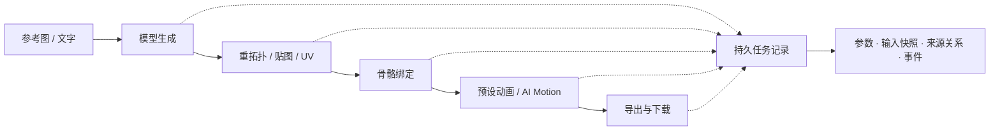

# Tripo Studio 使用指南

[返回 README](../README.md) · [工具清单](../TOOL_INVENTORY.md) · [Agent 使用指南](../skills/tripo-studio/SKILL.md)

## 选择生成路线

| 路线 | 可配置内容 | 适用场景 |
| --- | --- | --- |
| High Detail | H2.5 / H3.0 / H3.1；H3.1 独立几何质量；面数、2K / 4K / 8K 贴图、PBR、去光照与分件等受支持组合 | 角色、道具和需要表面细节的资产 |
| Smart Mesh P2 | 500–25,000 面、四边形拓扑、1 / 2 / 4 个变体及匹配的面数预算 | 控制游戏资产的网格预算 |
| 多视图 | 本地固定视角图片或已有 Studio 多视图资产 | 同一物体的不同视角生成一个模型 |
| 独立批量 | 最多 30 张独立图片，配合变体最多 120 个输出位 | 每张图片分别生成模型 |

Smart Mesh 不接受 High Detail 的贴图、几何质量与分件参数。High Detail 的分件生成不能同时开启贴图或四边形拓扑；工具会校验受支持的组合。

图片也可作为上游：生成／编辑参考图 → 四视图生成 → 建模。已接入 GPT Image 2.5 等图片模型，支持本地与 Studio 图片引用、重新生成、4K 放大及自动主体切出。

## 提交、报价与草稿

| 调用方式 | 行为 |
| --- | --- |
| 单个生成／编辑工具，省略 `submit` 或设为 `false`，保持默认 `review:true` | 返回配置卡片；立即确认或 60 秒后自动提交，进入编辑暂停倒计时 |
| `review:false, submit:false` | 仅准备草稿；用返回的精确确认信息调用 `tripo_submit_task` 执行 |
| `submit:true` | 准备并直接执行，用于明确要求立即执行的请求 |
| `tripo_run_workflow` | `submit` 默认 `true`，执行到达的步骤；仅预览时设为 `false`，并确保步骤不覆盖此设置 |

配置卡片展示输入缩略图、模型版本、面数、几何质量、贴图、PBR 和费用预估。修改参数后会重新校验与报价；保存修改后重启提交倒计时。工作台使用独立草稿与确认流程，配置修改会使旧报价失效，提交时展示本次冻结参数。

`tripo_get_payment` 查询账号积分与会员信息；`tripo_quote_operation` 估算指定操作或已暂存任务的费用，不提交生成任务。报价可以结合会员折扣和试用信息，最终扣费以 Studio 为准；`estimated_credits:null` 表示未知费用。通过 `tripo_list_operations` 查看每项操作的 `consumes_credits` 标记。

机制与报价边界见[配置卡片](CONFIRMATION_CARD_0_3_1.md)及[报价说明](PRICING_QUOTES_2026-10-08.md)。

## 继续处理模型

先用 `tripo_get_model` 检查项目实际能力、部件与前置条件，再选择步骤。

| 环节 | 能力与前置条件 |
| --- | --- |
| 网格与部件 | 模型导入、语义分件、部件补全、重拓扑与面数控制 |
| 材质 | 贴图生成、编辑预览与应用、贴图放大及 PBR |
| Smart UV | 读取上下文 → 生成／重试候选 → 检查或下载候选 GLB 与 UV 布局 → 单独应用；生成候选不会替换当前模型 |
| 自动绑定 | 默认 Rig V3；人形骨架支持 ActorCore / Mixamo / Unreal / VRM / Unity，须通过双足预检查；保留旧版绑定选项 |
| 预设动画 | 查询可用预设，再为匹配骨架的已绑定模型应用 |
| AI Motion | 1–5 个阶段，每阶段 1–10 秒；可设置衔接的路径点，生成后重定向到受支持的双足绑定模型 |

这是可选处理链，各步使用独立任务记录；可执行步骤取决于模型能力。

## 整理分组与延续角色

资产库以一张分组卡片展示名称、成员预览和完整数量。模型与图片可以属于同一组，在各自资产页查看。直接点击资产可多选、跨页保留选择，并创建分组、加入已有组或移出组。

Agent 使用 `tripo_list_asset_groups`、`tripo_list_group_assets`、`tripo_create_asset_group`、`tripo_set_asset_group` 和 `tripo_rename_asset_group` 管理同一份数据。分组在本地按 Studio 账号隔离，不消耗积分；重命名保留 ID 与成员，移出分组保留原资产。具体调用、分页和合并组见[资产分组用法](../skills/tripo-studio/references/asset-groups.md)。

新创作使用 `character_name` 指定角色，用 `parent_task_id` 延续来源任务。系统也会依据已记录的项目、图片或本地输出继承归属，不依赖视觉识别猜测。修改已有任务的角色用 `tripo_set_task_character`；资产组改名不会修改任务的 `character_name`。详见[角色来源继承](CHARACTER_GROUPING_0_3_1.md)。

## 任务来源与恢复

操作记录稳定的本地任务 ID、实际参数、输入快照与哈希、远端项目／操作／资产关联、事件及下载。任务中心可查看进度与结果，插件重启后仍可读取既有记录。

追查来源时，调用 `tripo_get_task` 并设置 `include_events:true`，沿已记录的 `parent_task_id` 查看上游。`tripo_run_workflow` 可衔接上游项目、动作资产、UV 候选、本地模型、渲染相机与烘焙贴图；`render_from_previous` 延续相机／视口参数，`textures_from_previous` 将烘焙结果传给贴图应用。依赖步骤需要上一步完成；相机传递不会自动提供编辑后的图片。

请求结果不明时记录为 `outcome_unknown`，需通过 `tripo_task_reconcile` 核对并采用远端 ID，不能自动重复提交。生成与下载完成分别记录，下载失败后可继续获取既有产物。后台账号查询、报价、同步与下载保留当前预览；需要主动展示已有结果时用 `tripo_show_result`。详见[预览持久化](PREVIEW_PERSISTENCE_2026-10-09.md)。

## 导出与下载

1. 对自有 Studio 项目调用 `tripo_export_model`，明确 `format`：GLB / FBX / OBJ / USDZ / STL / 3MF。
2. 按用途配置贴图尺寸与打包、骨架、选定动画、UV 打包、FBX 预设、原地动画、帧烘焙或 OBJ 顶点颜色。
3. 用 `tripo_task_sync` 或 `tripo_task_wait` 等待导出完成。
4. 用 `tripo_download` 下载**导出任务的 `task_id`**，获取指定格式的产物。下载工具不接受格式转换参数；修改扩展名也不会转换文件。

贴图打包可能返回模型与贴图的 ZIP。下载保留源文件；meshopt GLB 会尝试生成独立解码副本供 Blender 使用。ZIP／GLB 中超过请求尺寸的贴图会在本地降采样，并记录实际尺寸与哈希，不会升采样。需调整尺寸的内嵌 FBX 或 USDZ 会被明确拒绝，可改用 ZIP FBX／OBJ 或 GLB。详见[导出贴图验证](EXPORT_RESOLUTION_FIX_2026-10-08.md)。

## 本地编辑

六种本地操作无需登录、不上传输入、不消耗 Studio 积分，并保留源文件。模型工具使用自包含 GLB，自动解码受 150 MiB 限制；解码失败时仍保留已下载的源文件与错误说明。

| 工具 | 作用 |
| --- | --- |
| `tripo_inspect_local_parts` | 用 Blender 读取部件、面数、UV 与蒙皮信息，估算部件 UV 利用率 |
| `tripo_render_model` | 用后台 Blender 生成 2× 视口 WebP，返回相机矩阵、FOV 与视口尺寸 |
| `tripo_edit_parts` | 在模型副本中合并、隐藏、删除部件或按导入后的面索引分离；拒绝蒙皮部件的结构编辑 |
| `tripo_bake_texture_projection` | 按实际渲染相机将编辑视口图投影到部件 UV，并烘焙底色贴图 |
| `tripo_paint_texture` | 在贴图副本上按 UV 笔划绘制 |
| `tripo_crop_image` | 按明确像素矩形裁切图片副本 |

UV 利用率是 256×256 网格上的估算。投影烘焙按面中心判断可见性，大三角形和复杂材质需检查结果。烘焙或绘制产物可继续交给 `tripo_apply_texture_edits`；几何或 UV 改变后须先检查贴图兼容性。本地操作的实际验证见[能力契约与本地处理记录](CAPABILITY_UPDATE_2026-10-08.md)。
