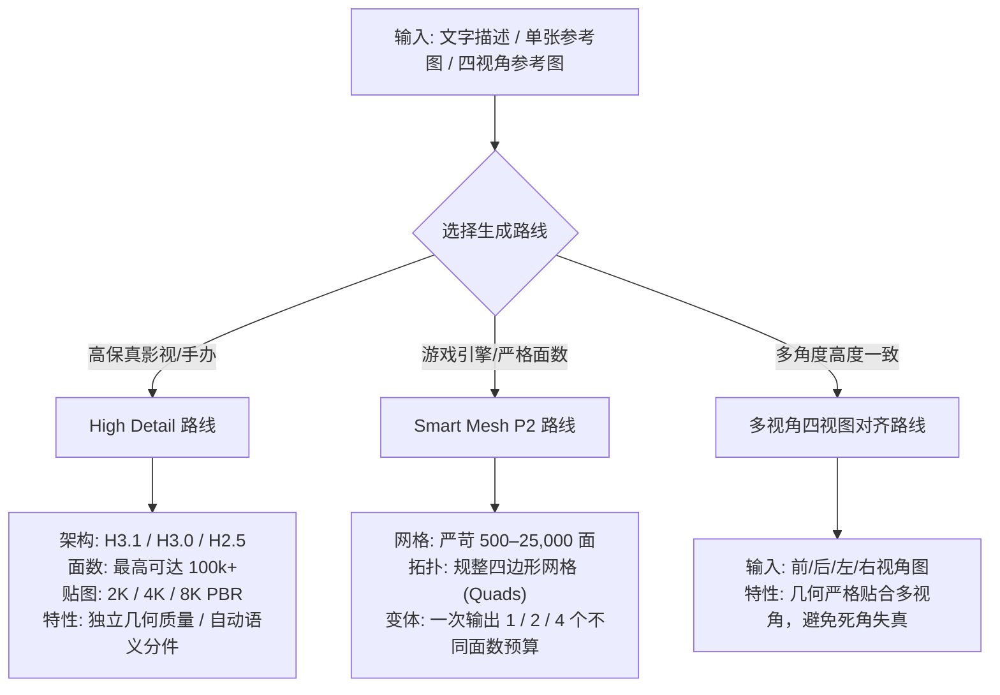

# 3D 生成与多模态创作工具指南 (Generation Pipeline)

[返回工具总览](README.md) · [返回主 README](../../README.md) · [网格与材质工具](mesh-texture.md) · [绑定与动画工具](rigging-animation.md) · [本地 Blender 工具](local-blender.md)

Tripo Studio for Codex 提供了业界顶尖的云端 AI 3D 资产生成管线，覆盖从概念图草绘、多视角拓展到游戏工业级 Smart Mesh 与高精细节建模的全流程。

---

## 包含的 MCP 工具

| 工具名 | 操作类型 | 消耗积分 | 核心作用 |
| --- | --- | :---: | --- |
| `tripo_generate_model` | `model.generate` | 是 | 核心 3D 资产生成：单图生成、文字生成、四视角生成、Smart Mesh P2 多变体 |
| `tripo_generate_image` | `image.generate` | 是 | 概念设计生图：内置高质量画风与模板，为 3D 建模准备基准图 |
| `tripo_generate_multiview` | `image.multiview` | 是 | 多视角概念生成：自动衍生前/后/左/右视角一致性参考图 |
| `tripo_regenerate_image` | `image.regenerate` | 是 | 参考图重绘与局部风格变体生成 |
| `tripo_upscale_image` | `image.upscale` | 是 | 概念参考图 4K 超分辨率放大 |
| `tripo_split_image` | `image.split` | 是 | 拼接参考图自动切分分离独立主体 |
| `tripo_import_model` | `model.import` | 否 | 导入外部自包含 GLB/OBJ 模型进入管线，不消耗积分 |
| `tripo_list_image_templates` | - | 否 | 获取系统概念风格库模版 |

---

## 核心生成路线对比



### 1. High Detail 路线 (高精度细节资产)
- **适用场景**：高精手办、影视道具、次世代展陈资产、复杂曲面角色。
- **核心参数**：
  - `model_version`: 推荐 `H3.1`（官方最新架构），也可选 `H3.0` 或 `H2.5`。
  - `geometry_quality`: `high` / `standard`（H3.1 支持独立几何质量调节）。
  - `face_limit`: 目标面数上限（例如 50,000 ~ 80,000 面）。
  - `texture_resolution`: 贴图精度，可选 `2048` / `4096` / `8192`。
  - `pbr`: 设为 `true` 同步生成法线贴图与粗糙度材质。

### 2. Smart Mesh P2 路线 (严苛游戏多边形预算)
- **适用场景**：实时游戏资产（Unity/Unreal）、移动端 AR、VR、轻量级 WebGL。
- **核心参数**：
  - `face_limit`: 500 ~ 25,000 面精确控制。
  - `quad`: 默认开启，生成干净的纯四边形拓扑结构，便于下游动画蒙皮变形。
  - `variants`: 支持单次生成同时指定 1、2 或 4 个不同面数梯度的变体模型（如 LOD0 10,000 面与 LOD1 3,000 面）。

---

## 对话安全机制：60 秒倒计时配置卡片

在对话流中调用生成工具时，插件默认进入安全预览模式（`review:true`），绝不背着用户偷偷扣点：

<div align="center">
  
  
</div>

- **智能参数预设**：Agent 自动将自然语言解析为详细专业参数并呈现在卡片中。
- **积分透明预估**：连接用户真实会员等级，卡片顶部实时展示本次生成的预估积分消耗。
- **60 秒倒计时防手滑**：卡片提供 60 秒自动确认倒计时；用户只要点击“编辑参数”，**倒计时立刻暂停**！
- **重新报价**：在卡片中修改面数或版本后保存，系统会自动校验合法性并刷新报价，再重新启动倒计时。
- **草稿模式**：如果对 Agent 说明“只准备草稿不要提交”，Agent 会传递 `review:false, submit:false`，任务将暂存在待处理队列中。

---

## 可视化工作台创建面板

除了对话驱动，还可以随时通过 `tripo_open_workbench` 打开可视化创建面板进行图形化创作：

<div align="center">
  
</div>

---

## 典型对白范例 (Prompts)

### 场景 1：概念参考图生成高质量 H3.1 资产
```text
请用附带的参考图生成「机甲先锋」3D 模型：
- 采用 H3.1 架构
- 几何质量设定为 high，面数预算 60,000 面
- 开启 4K PBR 贴图
- 先展示配置卡片，让我确认积分后再执行
```

### 场景 2：游戏 Smart Mesh 多变体网格
```text
我需要为 Unity 项目制作一个道具：
- 风格依据参考图，使用 Smart Mesh P2
- 要求规整四边面拓扑
- 给我生成两个不同 LOD 变体：3,000 面与 8,000 面
- 准备草稿即可，不要自动扣分
```

### 场景 3：多视角四视图建模
```text
我上传了四张角色的三视图图片（正面、左侧、背面、右侧）。
请调用 tripo_generate_model 采用多视角对齐管线进行统一建模。
```
