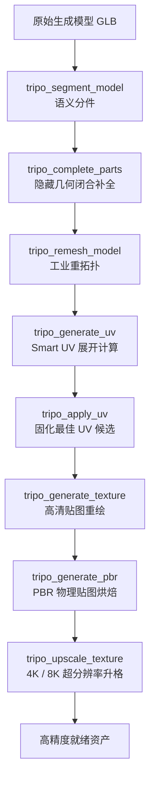

# 网格工坊与材质管线工具指南 (Mesh & Texture Pipeline)

[返回工具总览](README.md) · [返回主 README](../../README.md) · [3D 生成工具](generation.md) · [绑定与动画工具](rigging-animation.md) · [本地 Blender 工具](local-blender.md)

模型几何生成完毕后，Tripo Studio for Codex 提供了工业级别的后处理工坊，涵盖语义分件、网格破损补全、多边形重拓扑 (Remesh)、Smart UV 展开与 8K PBR 材质烘焙。

---

## 包含的 MCP 工具

| 工具名 | 操作标识 | 消耗积分 | 功能概述 |
| --- | --- | :---: | --- |
| `tripo_segment_model` | `model.segment` | 是 | **语义分件**：将单一网格智能剖解为逻辑独立部件（头、身、手、武器等） |
| `tripo_complete_parts` | `model.complete_parts` | 是 | **部件补全**：修复模型部件的隐蔽面、开孔与缺失几何，形成封闭流形体 |
| `tripo_remesh_model` | `model.remesh` | 是 | **网格重拓扑**：规整多边形布线与流向，精确压降或优化网格面数 |
| `tripo_generate_uv` | `model.uv_generate` | 是 | **Smart UV 候选生成**：智能生成并展开低拉伸、高利用率的 UV 岛 |
| `tripo_apply_uv` | `model.uv_apply` | 否 | 将满意的 UV 候选方案固化并应用至模型（不消耗积分） |
| `tripo_get_uv_context` | - | 否 | 检视当前模型的 UV 展开状态、算子信息与候选列表 |
| `tripo_generate_texture` | `texture.generate` | 是 | **重新生成贴图**：根据新提示词或风格为现有模型重绘全套表面色彩 |
| `tripo_preview_texture_edit` | `texture.edit_preview` | 是 | **贴图局部编辑预览**：选定局部区域进行重绘与微调，先看效果 |
| `tripo_apply_texture_edits` | `texture.edit_apply` | 是 | 正式固化局部重绘的贴图修改结果 |
| `tripo_upscale_texture` | `texture.upscale` | 是 | **贴图超分辨率**：将模型贴图无损放大至 4K 或 8K 超高清晰度 |
| `tripo_generate_pbr` | `texture.pbr` | 是 | **PBR 材质通道生成**：提取法线 (Normal)、粗糙度 (Roughness)、金属度 (Metallic) 物理渲染贴图 |

---

## 模型详情检视与重拓扑面板

在工作台中选中模型项目后，可以清晰检视模型的几何结构、材质通道与分件列表，并直接发起重拓扑或贴图操作：

<div align="center">
  
</div>

---

## 核心后处理工作流



### 1. 语义分件与几何补全 (Segmentation & Completion)
以往 AI 生成的 3D 模型常常是“粘连”在一起的实心网格，难以给角色换装或单独制作部件动画。
- **语义分件 (`tripo_segment_model`)** 能够依据几何特征识别角色躯干、护甲、披风、武器等不同组件，并切分为子网格 (Sub-meshes)。
- **部件补全 (`tripo_complete_parts`)** 针对被遮挡面（如护甲下方贴着身体的内凹部分）进行形态推测与自动几何闭合封口，保证拆卸下来的每一个部件都是自封闭的完整模型。

### 2. 工业级重拓扑 (Retopology · Remesh)
- 将混乱的三角面重新规整为四边形环线。
- 可任意指定目标面数（例如将 80,000 面高模压降为 6,000 面轻量级游戏道具）。
- 保证布线流向严格贴合模型的骨骼关节旋转轴。

### 3. Smart UV 机制
- `tripo_generate_uv` 生成候选方案时**绝不会直接覆盖原有模型**。
- 生成的候选方案包含直观的 2D UV Layout 图与贴图接缝分布。
- 开发者与 Agent 可以先下载候选 GLB，确认无畸变与重叠后再调用 `tripo_apply_uv` 正式生效。

### 4. 8K PBR 与贴图局部微调
- **PBR 通道支持**：自动烘焙真实物理光照所需的法线贴图（Normal Map）、粗糙度贴图（Roughness Map）与金属度贴图（Metallic Map），导出后可直接放入 Blender Eevee/Cycles、Unreal Engine 5 Lumen 或 Unity HDRP。
- **无损升格**：通过 `tripo_upscale_texture`，即便初始贴图为 1024/2048，也能通过专用 AI 卷积超分网络重构出 4096 / 8192 极清纹理。

---

## 典型对白范例 (Prompts)

### 场景 1：模型分件与独立部件修复
```text
请检视这个机械装甲模型：
1. 帮我对它执行语义分件，把外甲、头盔与内部机械结构拆开。
2. 对拆开的部件调用 tripo_complete_parts 进行背面闭合补全。
```

### 场景 2：游戏轻量化重拓扑
```text
这个模型面数太高了（有 75,000 面），请调用 tripo_remesh_model：
- 目标面数控制在 8,000 面左右
- 保持四边面布线流向
- 先出草稿卡片展示预估积分
```

### 场景 3：生成 4K PBR 次世代材质
```text
给当前模型生成 PBR 贴图：
- 分辨率设为 4K
- 生成法线与粗糙度贴图通道
- 完成后提供下载链接
```
