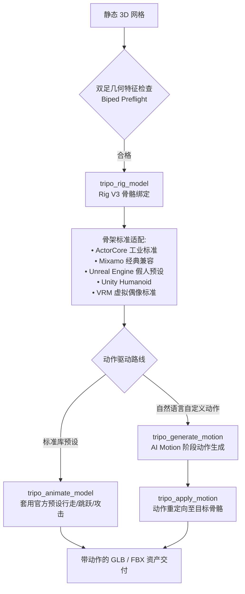

# 骨骼绑定与 AI 动作系统指南 (Rigging & AI Motion)

[返回工具总览](README.md) · [返回主 README](../../README.md) · [3D 生成工具](generation.md) · [网格与材质工具](mesh-texture.md) · [本地 Blender 工具](local-blender.md)

Tripo Studio for Codex 内置官方最新 **Rig V3** 自动化骨架绑定体系，并深度集成了 **AI Motion** 文本驱动连续动作生成与重定向引擎，让静态 3D 资产秒变动作主角。

---

## 包含的 MCP 工具

| 工具名 | 操作标识 | 消耗积分 | 功能概述 |
| --- | --- | :---: | --- |
| `tripo_rig_model` | `model.rig` | 是 | **Rig V3 自动骨架绑定**：智能识别双足/人形结构，自动安插骨骼层级与计算蒙皮权重 (Skin Weights) |
| `tripo_animate_model` | `model.animate` | 是 | **预设动画应用**：为已绑定的模型套用行走、奔跑、战斗、攻击等标准动画剪辑 |
| `tripo_list_animation_presets` | - | 否 | **预设动画库查询**：读取可用的动画模板列表及其适配骨架规格 |
| `tripo_generate_motion` | `motion.generate` | 是 | **AI Motion 文本动作生成**：通过自然语言分阶段生成自定义高难度全身动作动画 |
| `tripo_apply_motion` | `model.apply_motion` | 是 | **动作重定向 (Retargeting)**：将生成的 AI Motion 动作平滑烘焙到指定双足绑定模型上 |
| `tripo_list_motions` | - | 否 | 列出当前账号已生成的 Motion 动作资产库与正在计算的任务 |
| `tripo_get_motion` | - | 否 | 读取特定 Motion 动作资产的元数据与预览文件 |

---

## 绑定与动画架构



---

## 核心能力详解

### 1. Rig V3 自动骨骼绑定与工业骨架适配
- **智能解算**：基于深度学习几何特征分析，自动定位脊椎、颈部、肩膀、手肘、手腕、膝盖与脚踝关节。
- **权重平滑**：优化关节弯曲时的蒙皮拉伸，防止“网格穿插”或“折叠凹陷”。
- **主流引擎骨架对齐**：
  - **Unreal Engine 5**：符合 UE 官方 Mannequin 骨架层级与命名，导出后直接在虚幻引擎中套用通用动捕动画。
  - **Mixamo**：完美适配 Mixamo 庞大的动作生态。
  - **Unity Humanoid**：直接被 Unity Mecanim 动画系统无缝识别。
  - **VRM**：支持 VTuber 与元宇宙虚拟化身标准。

### 2. 官方预设动画库 (`tripo_list_animation_presets`)
系统预置了大量现成的高质量动作库：
- 移动类：Walk（行走）、Run（奔跑）、Sprint（冲刺）、Jump（跳跃）、Sneak（潜行）。
- 战斗类：Attack（挥击）、Shoot（射击）、Defense（格挡）、Hit Reaction（受击）、Death（倒地）。
- 表现类：Idle（呼吸待机）、Wave（挥手）、Dance（舞蹈）。

### 3. AI Motion：分阶段复杂自定义动作
AI Motion 允许用连续语言描述一组连贯的复杂动作序列：
- 支持 **1 到 5 个阶段 (Stages)** 级联编排。
- 每个阶段可设定 **1 到 10 秒** 的时长。
- 支持指定空间轨迹点与衔接姿态（例如“阶段 1：向右侧翻滚两周；阶段 2：单手撑地起身；阶段 3：拔剑刺出”）。
- 生成完毕后，调用 `tripo_apply_motion` 自动重定向至任何已通过 Rig V3 绑定的角色。

---

## 典型对白范例 (Prompts)

### 场景 1：自动检测并绑定双足角色
```text
检查我刚刚生成的「赛博战士」模型：
1. 评估其是否具备双足绑定条件。
2. 使用 Rig V3 引擎进行自动骨架绑定，使用 Unreal 兼容骨架预设。
3. 展示草稿卡片并在确认后执行。
```

### 场景 2：查询并套用预设奔跑动作
```text
帮我查一下可用的动画预设列表。
把名为「Run_Forward」的预设动作应用到赛博战士模型上，生成一个包含奔跑动画的 GLB。
```

### 场景 3：AI Motion 自定义组合武术动作
```text
请为我的主角设计一个连续武术动作：
- 阶段 1 (3秒)：摆出咏春拳起手势待机；
- 阶段 2 (4秒)：向前连续快速打出连环冲拳；
- 阶段 3 (3秒)：后撤步抱拳收势。
调用 tripo_generate_motion 生成这个动效，完成后重定向到主角身上！
```
